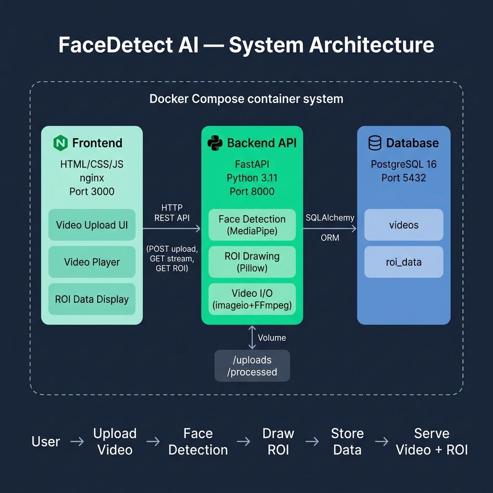

# Face Detection Video API

A containerized full-stack application that accepts video uploads, detects faces using **MediaPipe** (no OpenCV), draws axis-aligned bounding boxes (ROI) using **Pillow**, stores ROI data in **PostgreSQL**, and serves processed videos with a modern web frontend.



---

## Quick Start (5 minutes)

### Prerequisites
- [Docker](https://docs.docker.com/get-docker/) and [Docker Compose](https://docs.docker.com/compose/install/) installed
- That's it — no Python, no Node.js needed on your machine

### Run

```bash
# 1. Clone the repository
git clone <repo-url>
cd face-detection-api

# 2. Start everything
docker-compose up --build

# 3. Open the app
#    Frontend:  http://localhost:3000
#    API Docs:  http://localhost:8000/docs
```

### Stop

```bash
docker-compose down          # Stop containers
docker-compose down -v       # Stop and remove volumes (deletes DB data)
```

---

## Architecture

```
┌──────────────────────────────────────────────────────────┐
│                   Docker Compose Network                 │
│                                                          │
│  ┌────────────┐    ┌───────────────┐    ┌─────────────┐  │
│  │  Frontend   │───▶│    Backend    │───▶│  PostgreSQL  │ │
│  │  (nginx)    │    │   (FastAPI)   │    │   (DB)       │ │
│  │  :3000      │    │   :8000       │    │   :5432      │ │
│  └────────────┘    └───────────────┘    └─────────────┘  │
│                          │                               │
│                    ┌─────┴──────┐                        │
│                    │  Volumes   │                        │
│                    │  /uploads  │                        │
│                    │  /processed│                        │
│                    └────────────┘                        │
└──────────────────────────────────────────────────────────┘
```

| Service    | Tech           | Purpose                            |
|------------|----------------|------------------------------------|
| Frontend   | Nginx + HTML/CSS/JS | Upload UI & video player       |
| Backend    | FastAPI (Python 3.11) | API, face detection, video processing |
| Database   | PostgreSQL 16  | Store video metadata & ROI data    |

---

## API Endpoints

| Method | Endpoint                        | Description                       |
|--------|---------------------------------|-----------------------------------|
| `POST` | `/api/v1/video/upload`          | Upload a video for processing     |
| `GET`  | `/api/v1/video/{id}/stream`     | Serve the processed video         |
| `GET`  | `/api/v1/video/{id}/roi`        | Get ROI data for all frames       |
| `GET`  | `/api/v1/video/{id}/status`     | Check processing status           |
| `GET`  | `/health`                       | Health check                      |
| `GET`  | `/docs`                         | Interactive API documentation     |

### Example: Upload a video via curl

```bash
curl -X POST http://localhost:8000/api/v1/video/upload \
  -F "file=@sample_video.mp4"
```

Response:
```json
{
  "id": "a1b2c3d4-...",
  "filename": "sample_video.mp4",
  "status": "processing",
  "message": "Video uploaded successfully. Processing started."
}
```

### Example: Get ROI data

```bash
curl http://localhost:8000/api/v1/video/{video_id}/roi
```

Response:
```json
{
  "video_id": "a1b2c3d4-...",
  "total_frames": 150,
  "faces_detected": 142,
  "roi_data": [
    {
      "frame_number": 0,
      "x_min": 120, "y_min": 80,
      "x_max": 320, "y_max": 350,
      "confidence": 0.97
    }
  ]
}
```

---

## Tech Stack & Design Decisions

| Decision | Choice | Why |
|----------|--------|-----|
| Face Detection | MediaPipe | Google's ML library, lightweight, no OpenCV needed |
| Image Drawing | Pillow (PIL) | Pure-Python image manipulation, draws rectangles without OpenCV |
| Video I/O | imageio + FFmpeg | Reads/writes video frames without OpenCV |
| Database | PostgreSQL | Relational data (videos → ROI records), ACID, well-supported |
| API Framework | FastAPI | Async, auto-generated OpenAPI docs, type-safe |
| Background Processing | Threading | Simple approach for single-worker. Could upgrade to Celery for production. |

---

## Database Schema

```
┌─────────────┐         ┌─────────────┐
│   videos    │ 1 ── N  │  roi_data   │
├─────────────┤         ├─────────────┤
│ id (UUID PK)│◄────────│ video_id FK │
│ filename    │         │ frame_number│
│ status      │         │ x_min       │
│ width       │         │ y_min       │
│ height      │         │ x_max       │
│ fps         │         │ y_max       │
│ frame_count │         │ confidence  │
│ created_at  │         │ created_at  │
│ updated_at  │         └─────────────┘
└─────────────┘
```

---

## Testing

Tests run inside the Docker container or locally with dependencies installed:

```bash
# Run all tests
cd backend
pip install -r requirements.txt
pytest tests/ -v

# Run specific test file
pytest tests/test_face_detector.py -v
pytest tests/test_drawing.py -v
pytest tests/test_api.py -v
```

---

## Project Structure

```
face-detection-api/
├── docker-compose.yml          # Orchestration
├── README.md
├── architecture.png            # Architecture diagram
├── .env.example                # Environment template
├── .gitignore
│
├── backend/
│   ├── Dockerfile
│   ├── requirements.txt
│   └── app/
│       ├── main.py             # FastAPI entrypoint
│       ├── core/
│       │   ├── config.py       # Settings (env vars)
│       │   └── database.py     # SQLAlchemy engine
│       ├── models/
│       │   ├── video.py        # Video ORM model
│       │   └── roi.py          # ROI ORM model
│       ├── schemas/
│       │   ├── video.py        # Response schemas
│       │   └── roi.py          # Response schemas
│       ├── services/
│       │   ├── face_detector.py    # MediaPipe face detection
│       │   └── video_processor.py  # Video pipeline
│       └── api/
│           └── routes.py       # API endpoints
│
├── frontend/
│   ├── Dockerfile
│   ├── nginx.conf
│   ├── index.html
│   ├── css/style.css
│   └── js/app.js
│
└── backend/tests/
    ├── conftest.py             # Shared fixtures
    ├── test_face_detector.py   # Detection unit tests
    ├── test_drawing.py         # ROI drawing tests
    └── test_api.py             # API integration tests
```

---

## Security

- Non-root user in backend container
- File extension validation on uploads
- File size limits (100 MB)
- CORS restricted to known origins
- Security headers via nginx (X-Frame-Options, X-Content-Type-Options)
- No secrets in code (env vars via docker-compose)
- SQL injection prevention via SQLAlchemy ORM

---

## Error Handling

| Scenario | HTTP Code | Response |
|----------|-----------|----------|
| Invalid file type | 400 | `"File type '.txt' not allowed"` |
| Empty file | 400 | `"Empty file uploaded"` |
| File too large | 413 | `"File too large (150.2 MB). Max: 100 MB"` |
| Video not found | 404 | `"Video not found"` |
| Still processing | 202 | `"Video is still being processed"` |
| Processing failed | 422 | Error details included |

---

## License

MIT
